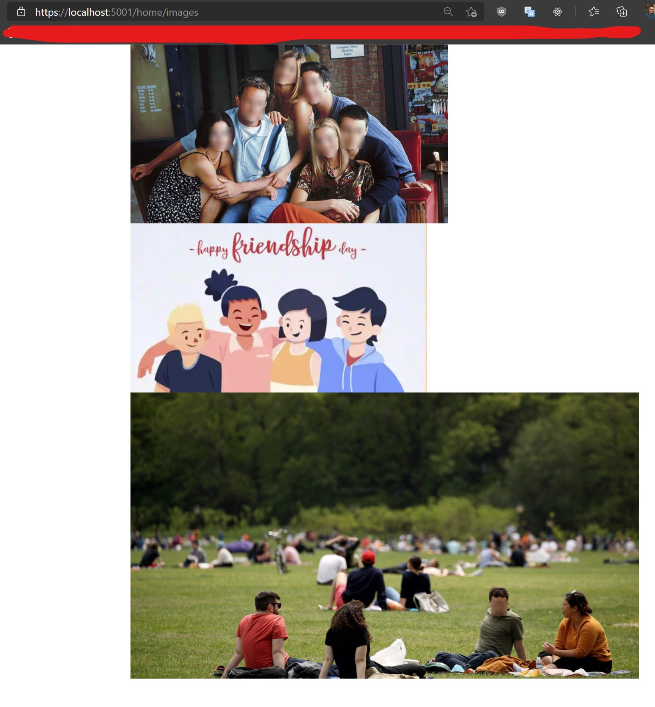

<h2>Build</h2>
<pre>
// cd "BlurFace.WebApp" project path
dotnet build
</pre>

<h2>Configuration</h2>
<pre>
"AzureFaceConfiguration": {
    "Endpoint": "ENDPOINT LIKE https://your-resource-name.cognitiveservices.azure.com/",
    "Key": "YOUR_KEY",
    "BlurRadius": 10 (or 5 or 3 ...)
}
</pre>

<h2>Main points</h2>

<strong>service-worker.js</strong> - intercept image requests and redirect to WebApp API

<strong>Azure Face Recognition</strong> - ;)

<h2>View Result</h2>

open in web browser https://SERVER-ADDRESS/home/images (https://localhost:5001/home/images - if local)

